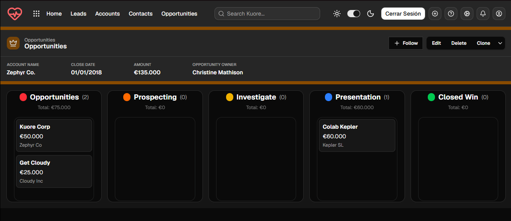

# Kuore

CRM de ventas con interfaz en Next.js: dashboard con gráficos, pipeline Kanban de oportunidades y listados de leads, cuentas y contactos. Lo desarrollé (parte frontend) durante mis prácticas FCT en Axarnet para el equipo comercial.

> **Estado:** solo frontend. Los datos de las pantallas son de ejemplo (definidos en el propio código) y el login es una simulación sin autenticación real. La capa de servicios con Axios (`services/`) está preparada para conectar una API REST, pero todavía no se usa en las pantallas.




## Qué incluye

- **Dashboard (`/home`)**: 5 gráficos Highcharts (área, columnas apiladas, donut, área con varias series y gráfico de nodos) con tema claro/oscuro.
- **Oportunidades (`/opportunities`)**: tablero Kanban de 5 etapas (Opportunities, Prospecting, Investigate, Presentation, Closed Win) con arrastrar y soltar usando `@dnd-kit`.
- **Leads, cuentas y contactos**: listados con vista de tabla y de cuadrícula.
- **Tema claro/oscuro** con `next-themes`.
- **Login simulado** que guarda un flag en `localStorage` para proteger la navegación en cliente.

## Stack

Next.js 16 · React 19 · TypeScript · Tailwind CSS v4 · shadcn/ui (Radix) · @dnd-kit · Highcharts · next-themes · Axios · Sonner

## Cómo ejecutarlo

```bash
npm install
npm run dev
```

Abre [http://localhost:3000](http://localhost:3000). En el login sirve cualquier email y contraseña no vacíos.

Opcional: para apuntar a una API propia, define `NEXT_PUBLIC_API_URL` (por defecto `http://localhost:8080/api/v1`).

## Estructura

```
app/            Rutas (home, opportunities, leads, accounts, contacts, login)
components/     Navbar, tema y componentes shadcn/ui
services/       Cliente Axios y servicio de horarios (sin conectar aún)
types/          Tipos TypeScript
```

## Qué me costó

- **Kanban con @dnd-kit:** mover tarjetas entre columnas y mantener el estado coherente al soltar (`DndContext`, `DragOverlay`, `useSortable`).
- **Tema oscuro en Highcharts:** los gráficos no heredan el tema de Tailwind, así que hubo que pasar colores de fondo, ejes, leyenda y tooltip según el tema activo.

## Pendiente

- Conectar las pantallas a una API real y sustituir los datos de ejemplo.
- Autenticación real.
- Tests automatizados.
- Extraer la configuración repetida de los gráficos a un tema común.
